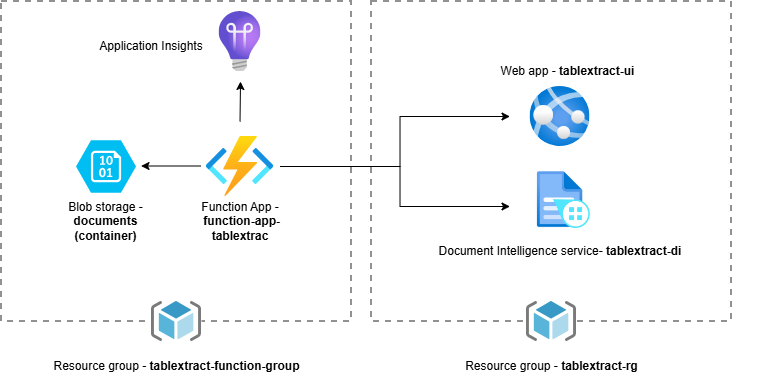

# azure-table-extract-app
### App architecture



### Repository structure
```
azure-table-extract-app/
├── .github/workflows/
    └── main.yml
├── README.md
├── config/
├── docs/
├── table-extract-function-app/
├── table-extract-frontend/
├── tests/
└── README.md
```
### Running the app locally

First create the virtual environment with requirements.txt using venv, uv, conda or another tool of your choice. Then run the instructions in order, with your environment activated.

In first terminal, use the following command to run streamlit frontend:
```bash
streamlit run app.py
```
