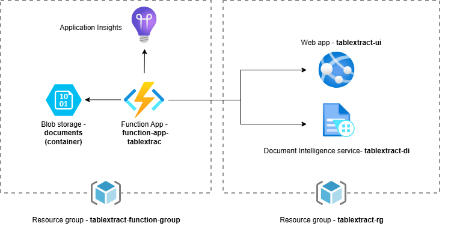

# azure-table-extract-app
### App architecture



### Main components description

| Functionality | Tech stack | Short description |
| :--- | :--- | :--- |
| **User interface** | Streamlit app hosted using Azure Web app | User interface to upload documents and retrieve table data in form of .csv files |
| **Backend** | API built with serverless Azure Function | Lambda responsible for communicating with Azure Document Intelligence service |
| **Storage** | Azure Blob Storage | Storage used to save documents uploaded by the app users |
| **IaC** | Terraform | Script and configuration that make it possible to reproduce the infrastructure |
| **CI/CD** | GitHub Actions | A pipeline that deploys app to Azure after changes are made |
| **Monitoring** | Application Insights; Alert rules | A summary and alert rules related to number of request, server response time and availability |

### Repository structure
```
azure-table-extract-app/
├── .github/workflows/
    └── main.yml
├── README.md
├── docs/
├── table-extract-function-app/
├── table-extract-frontend/
├── tests/
├── terraform/
└── README.md
```
### Running the app locally

First create the virtual environment with requirements.txt using venv, uv, conda or another tool of your choice. Then run the instructions in order, with your environment activated.

In first terminal, use the following commands to run streamlit frontend:
```bash
cd table-extract-frontend/
streamlit run app.py
```
In second terminal, run the following commands to run Function App locally:
```bash
cd table-extract-function-app/
func start
```

### Infra setup
To setup infrastructure on Azure, run following commands:
```bash
cd terraform/
chmod u+x terraform-deploy.sh
./terraform-deploy.sh
```
For cleanup, use the following command to remove Azure components created via Terraform (and confirm the resource deletion when prompted):
```bash
terraform destroy
```
